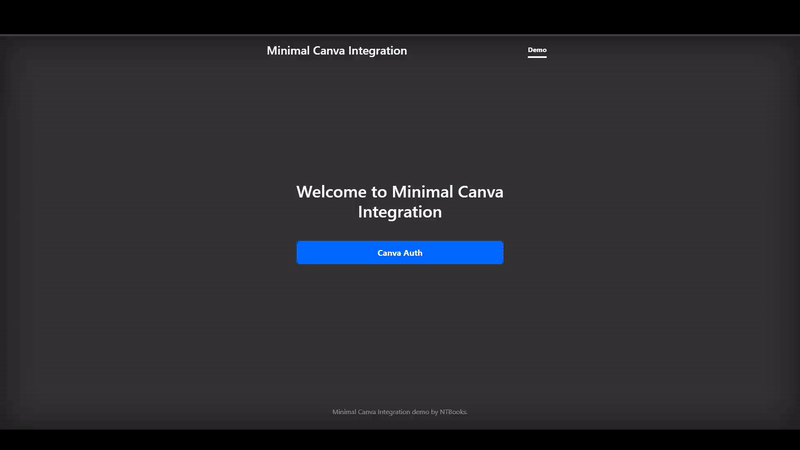

## Demo Overview

This demo demonstrates the bare minimum needed to authenticate with Canva, allow a user to create a design, retrieve an image of that design, and send it to a server.



## Design Considerations

- **Vanilla JavaScript**: The project uses vanilla JavaScript instead of TypeScript to keep the code clean and simple. In production, you might want to use TypeScript and a real UI framework like React or Vue.
- **Bootstrap CDN**: It leverages a CDN for Bootstrap to avoid the need for extensive embedded CSS. Bootstrap is not a requirement and is only included to enhance the demo's appearance.
- **Simple HTML Files**: The HTML files are straightforward, with script tags ensuring that all event listeners are located near the buttons that activate them.

## Highlights

- **[/public/index.html](./public/index.html)**: This is the main view for the application and has three states (User Logged Out, Handling Canva Return Request, and Displaying the User's Canva Design).
- **[/src/index.js](./src/index.js)**: All the route logic to connect to Canva is in this file.
- **[/public/canva_endpoints.js](./public/canva_endpoints.js)**: This includes a fetch utility function to send your Canva auth token to any Canva REST API endpoints. If you want to wrap the API without using a full API generator like the Canva quickstart, you would add those functions here.

You can mostly ignore the other files since they contain boilerplate to make the demo work (basic SQLite database, uploads folder, etc.).

## How to Run The Demo

1. **Set Up Canva Developer Account**:

   - Go to the [Canva Developer Portal](https://www.canva.com/developers/).
   - Create a new app and obtain your API keys.
   - For detailed instructions on setting up a Canva integration, refer to the [How to Set Up A Canva Integration](#how-to-set-up-a-canva-integration) section below.

2. **Clone the Repository**:

   ```sh
   git clone https://github.com/NTBooks/minimal-canva-demo.git
   cd minimal-canva
   ```

3. **Rename the .env File**:

   ```sh
   mv .env.sample .env
   ```

4. **Add Your Canva API Keys**:

   - Open the `.env` file and add your Canva API keys.

5. **Install Dependencies**:

   ```sh
   npm install
   ```

6. **Run the Demo**:

   ```sh
   npm run start
   ```

7. **Access the Application**:
   - Open your browser and go to `http://localhost:3001` or whatever port you set in the .env file.

Follow these steps to authenticate with Canva, create a design, retrieve an image of that design, and send it to a server.

## How to Set Up A Canva Integration

(I copied this section from the Canva Connect API Starter Kit since it's the same)

Before you can run this demo, you'll need to do some setup beforehand.

1. Open the [Developer Portal](https://www.canva.com/developers/integrations/connect-api), and click `Create an integration`.

2. Under `Configuration` → `Configure your integration`.

- `Integration name`: Add a name.
- `Client ID`: Make a note of this value; you'll need it in a later step.
- `Generate secret`: Click this and save the secret in a secure location, as you'll need it for a later step.

3. Under `Scopes` → `Set the scopes`, check the following boxes:

- `asset`: Read and Write.
- `brandtemplate:content`: Read.
- `brandtemplate:meta`: Read.
- `design:content`: Read and Write.
- `design:meta`: Read.
- `profile`: Read.

4. Under `Authentication` → `Add Authentication`, locate `URL 1` and enter the following value:

```
http://127.0.0.1:3001/canva/redirect
```

5. Under `Return navigation`, toggle on the `Enable return navigation` switch and enter the following as the `Return Url`:

```
http://127.0.0.1:3001/
```

If you're setting this up on a domain you'd put it in instead of the 127.0.0.1:3001 above.

## NOTES

- Unless your app is approved, only the canva account containing the `CANVA_CLIENT_ID` will be able to use the app.
- The uploaded files can be viewed in vscode in the upload folder as you debug the application. The application has no routes to download files.

## License

This project is licensed under the MIT License. See the [LICENSE](./LICENSE) file for details.
